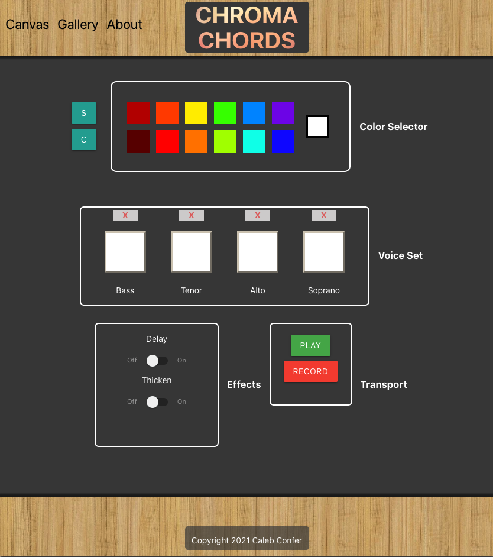
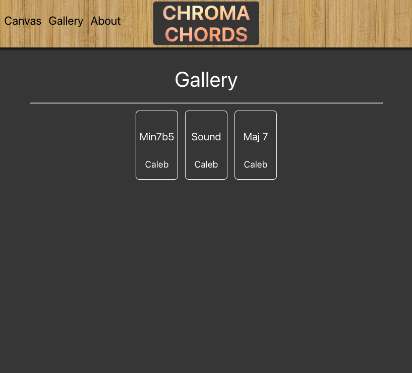
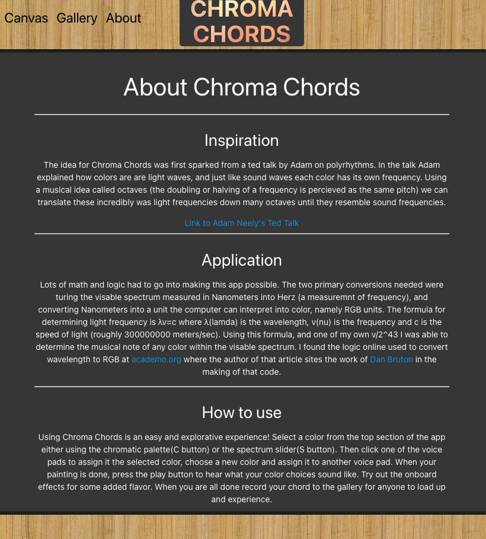
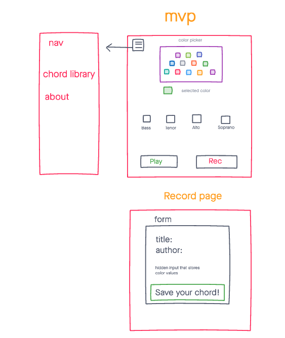
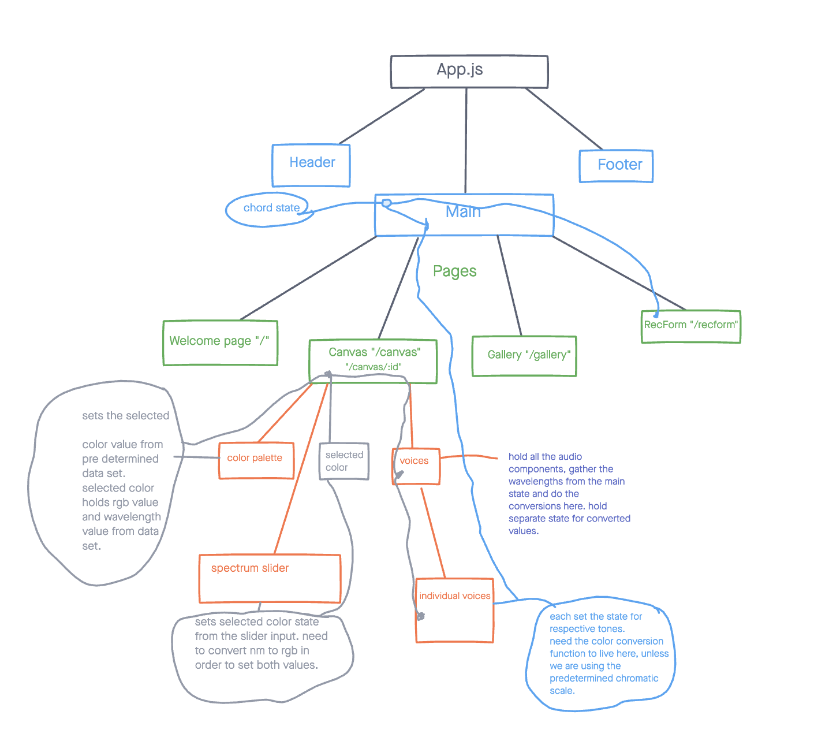
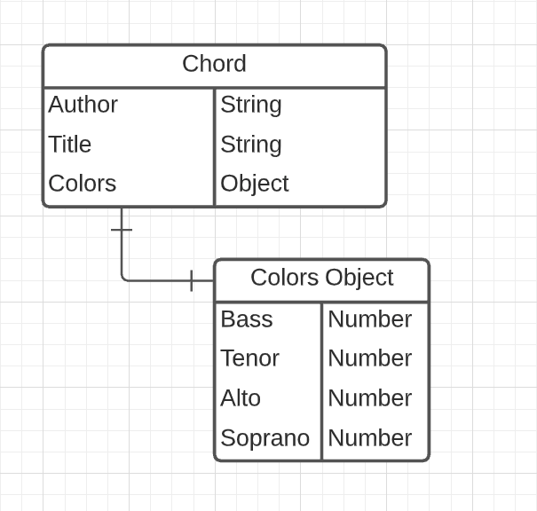

# Chroma Chords
a color based musical experiance. Use a range of colors to create unique musical chords. add some on board effects, then save your chord to share with friends. 

------
## Technologies
- Mongoose/MongoDB
- Express
- React
- Node.js
- CSS3
- HTML 5

---
## Screenshots
the canvas is where the magic happens.

the gallery is where all of the saved chords live.

check out the about page to learn more about the making of the app!

### Wire-frames
original mock up used to get the ball rolling.

A messy, but useful diagram for to represent the react components and the flow of data.

### ERD
original ERD, eventually a tones object was added aswell so the database stores both RGB values and Nanometer values. 

---
## Getting Started
[click here](https://chroma-chords.herokuapp.com/canvas/palette) to see the working app
## Future Enhancements
- Add a sequencer to a user can play multiple chords in order. 
- Add a midi export option so a user could send the data to a DAW(digital audio workstation).
- Create more custom effects and options for adjusting the sound. 
